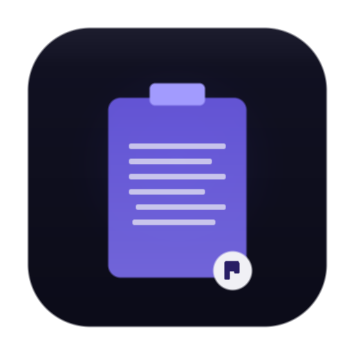

# PasteRack

A lightweight macOS menu bar clipboard manager with an encrypted password vault. Built with Electron.js.



## Features

### Clipboard History
- Monitors system clipboard and stores the last **100 copied items** in memory
- **Pin clips** to keep them at the top (pinned clips survive Clear All and never get evicted)
- **Search** through clipboard history
- Click any clip to copy it back to your clipboard
- Delete individual clips or clear all unpinned history
- Clipboard history is in-memory only — cleared on app quit for privacy

### Global Shortcuts
| Shortcut | Action |
|----------|--------|
| `⌘1` through `⌘9` | Instantly paste the 1st–9th clip |
| `⌘⇧V` | Toggle PasteRack popup |

### Encrypted Password Vault
- Store passwords and secrets with **AES-256-GCM encryption**
- Master password required to unlock the vault
- Key derived via **PBKDF2** (100,000 iterations, SHA-512)
- Each entry encrypted with a unique random IV
- Passwords masked by default — reveal with eye icon (auto-hides after 5s)
- Copy passwords to clipboard (auto-clears after 30s)
- Edit and delete saved passwords inline
- **Persisted to disk** at `~/.pasterack/vault.enc` — survives app restarts
- Vault auto-locks after 5 minutes of inactivity

### Menu Bar App
- Lives in the macOS top menu bar — no dock icon
- Opens on the current desktop space (no space switching)
- Click outside to dismiss
- Dark theme UI

## Install

### From DMG
1. Download the `.dmg` from [Releases](https://github.com/Priyadharshan0903/PasteRack/releases)
2. Drag PasteRack to Applications
3. First launch: **right-click > Open** (required once for unsigned apps)

### From Source
```bash
git clone https://github.com/Priyadharshan0903/PasteRack.git
cd PasteRack
npm install
npm start
```

### Build DMG
```bash
npm run build          # arm64 (Apple Silicon)
npm run build:x64      # Intel
npm run build:all      # Both (sequential)
```

Output goes to `dist/`.

## Project Structure

```
PasteRack/
├── main.js                   # Main process entry point
├── src/
│   ├── clipboard-store.js    # In-memory clipboard storage with pin support
│   ├── clipboard-watcher.js  # Clipboard polling (500ms interval)
│   ├── password-vault.js     # AES-256-GCM encrypted vault with disk persistence
│   ├── tray-manager.js       # macOS menu bar tray icon
│   ├── shortcut-manager.js   # Global keyboard shortcuts
│   └── window-manager.js     # Frameless popup window management
├── renderer/
│   ├── index.html            # Popup UI with History and Vault tabs
│   ├── styles.css            # Dark theme (purple accent palette)
│   ├── renderer.js           # UI logic, search, tabs, toast notifications
│   └── preload.js            # Secure IPC bridge (context isolation)
├── assets/
│   └── tray-iconTemplate.png # Menu bar icon
└── build/
    ├── icon.png              # App icon (512x512)
    └── dmg-bg.png            # DMG installer background
```

## Security

| Layer | Detail |
|-------|--------|
| Encryption | AES-256-GCM (authenticated encryption) |
| Key derivation | PBKDF2 — 100,000 iterations, SHA-512 |
| Salt | 32 random bytes per vault |
| IV | 16 random bytes per password entry |
| Auth tag | 16 bytes — detects tampering |
| Master password | Never stored — only a salted SHA-256 hash for verification |
| On lock/quit | Derived key overwritten with random bytes |
| On delete | Encrypted buffer overwritten before removal |
| File permissions | `~/.pasterack/vault.enc` created with mode `0600` |

## Tech Stack

- **Electron.js** — Desktop shell
- **Vanilla HTML/CSS/JS** — No framework, minimal footprint
- **Node.js `crypto`** — AES-256-GCM, PBKDF2, secure random
- **Electron APIs** — Tray, globalShortcut, clipboard, BrowserWindow

## License

MIT
